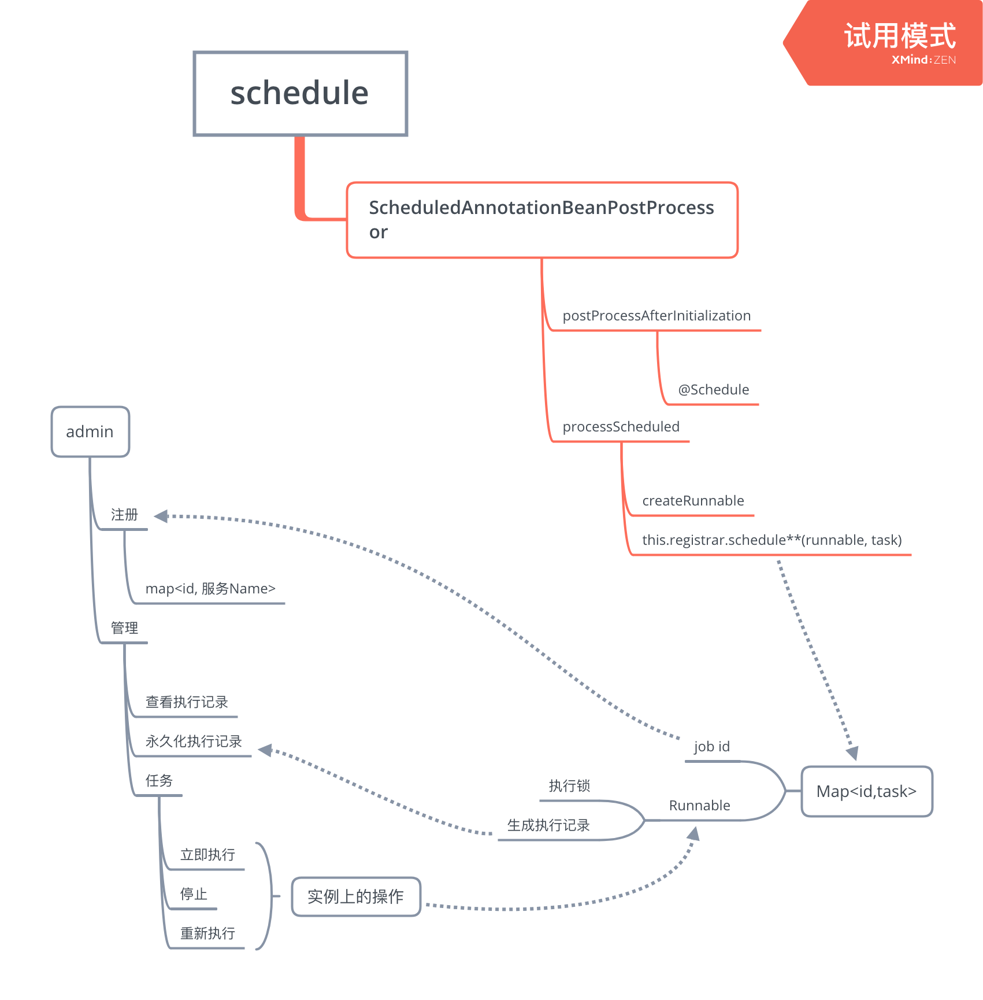

# schedule
基于spring schedule的分布式拓展

## 分布式执行

继承`ScheduledAnnotationBeanPostProcessor`, 通过重新`top.zeroone.job.annotation.JobScheduledAnnotationBeanPostProcessor.createRunnable`方法,在任务执行时通过`redis`锁判断是否执行

```java
@Override
public void run() {
    if (this.scheduledLock.ifLockDoNot()) {
        if (this.timeLock != null) {
            // 有些任务,短时间内不必重复执行.因没有等待执行,所以没有显式的解锁
            if (!this.timeLock.tryLock()) {
                log.debug("任务{}, time tryLock return false, 停止执行", this.name);
                return;
            }
        }

        if (this.lock.tryLock()) {
            try {
                invokeMethod();
            } finally {
                this.lock.unlock();
            }
        } else {
            if (log.isDebugEnabled()) {
                log.debug("任务{}, tryLock return false, 停止执行", this.name);
            }
        }
    } else {
        invokeMethod();
    }
}
```

## 实时查看任务

依赖`spring-boot-actuator`,自定义端点来查看和控制任务的执行
`top.zeroone.job.manager.JobManagerSchedulingConfigurer`

> `spring-boot-actuator` 有原生的监控schedule任务,但没有停止

## feature

1. 任务执行参数
2. 任务可以托管`admin`来统一控制管理,而不是在执行的服务上配置执行时间
3. 在任务取消后,可以再重新执行
4. 任务的执行状态可以查看(任务的feature)


## 设计




